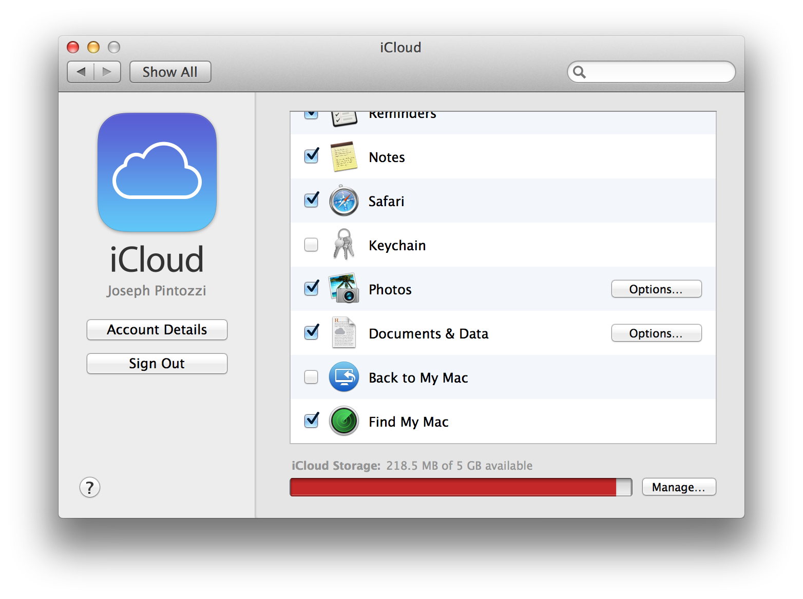

# Computer Security

The bulk of this document will be aimed preventative measures to keep your computer safe, and things you can do that will allow you to get your computer back if it is stolen.

## Table of Contents
* [Theft Recovery](#theft-recovery)
    * [Find My Mac](#find-my-mac)
    * [Prey](#prey)
* [Important File Backups](#important-file-backups)
    * [Dropbox](#dropbox)
    * [Box](#box)
    * [SugarSync](#sugarsync)
    * [Google Drive](#google-drive)

_Generated with [tocify](https://github.com/pyro2927/tocify)_

## Theft Recovery

Having your computer stolen sucks, and if you wait until it's stolen to do something it's already too late.  Before that happens, setup software on your computer to allow you to recover it if it is ever stolen.  **If your computer bag is stolen, and your computer and flash drives are all inside, you've just lost all of your data and your computer in one go.**  Taking a few minutes to read and follow the steps below can save your term paper from being lost, as well as potentially recover your laptop.

### Find My Mac

If you have a Mac computer that is atleast at version 10.8 or higher, you can use the free [Find My Mac](http://www.apple.com/support/icloud/find-my-device/) service.  If your device is stolen you can login to [iCloud](http://icloud.com) to track it down and hopefully recover it.  This is also useful for iPhones, iPod Touches, and iPads.  To enable it, simple enter `System Preferences.app`, open `iCloud`, and make sure that `Find My Mac` is checked.

### Prey

If you don't own a Mac, or prefer to not use Apple's services, you should at the very least use [Prey](http://preyproject.com/).  Prey allows you to track your computer via GPS and WiFi hotspots, and even take pictures with the webcam remotely!  You can then figure out where the thief is and what they look like, making it easy for the police to nab them.

Prey works on OS X, Windows, Linux, and even Android.

## Important File Backups

Data can be lost for a variety of reasons: theft, hard drive failure, and even just accidentally deleting a file.  It's important to use a backup system to have copies of your information in case any of these things happen.

Below are listed several backup services, most of which have a free plan that is more than ample for storing basic documents.  If you would like to install one, click on the link to go to their homepage and sign up!

### Dropbox

[Dropbox](http://dropbox.com/) is a great service that will store 2GB of your files for free.  It also has a variety of [mobile clients](https://www.dropbox.com/mobile) that allow you to open your files on the go.

### Box

[Box](https://www.box.com/) is similar to Dropbox, though initially it gives you 10GB of space for free.  It also has [many mobile apps](https://www.box.com/business/features/mobile-access/) that allow for access to your files while you're away from your computer.

### SugarSync

[SugarSync](https://www.sugarsync.com/), another syncing service.  While they don't avertise it heavily, there is a [free tier](https://www.sugarsync.com/free/) you can use that gives you 5GB of storage space.

### Google Drive

Almost everyone has a Google account already, which makes using [Google Drive](http://www.google.com/drive/about.html) super easy.  You don't need to make a new account, all you need to do is download and install the [desktop client](https://tools.google.com/dlpage/drive) to sync your local files.  They also start you off with 15GB of space, which is more than most other backup providers.

